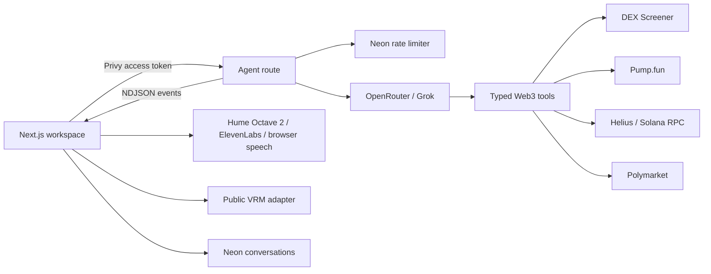

<p align="center">
  
</p>

<p align="center">
  <strong>A Web3-native agent architecture with an expressive 3D companion.</strong>
</p>

<p align="center">
  <a href="#quick-start">Quick start</a> ·
  <a href="#architecture">Architecture</a> ·
  <a href="#tools">Tools</a> ·
  <a href="./CONTRIBUTING.md">Contributing</a> ·
  <a href="./LICENSE">MIT</a>
</p>

AniBot takes the transparent, tool-using workflow people expect from products
like Grok Bot and rebuilds it as an open, composable stack for crypto. Ani can
research Solana markets, inspect wallets and token metadata, check Pump.fun
launch provenance, compare prediction markets, stream evidence into chat, and
speak the result through a VRM companion.

This repository is the public edition. It includes the full agent, auth,
streaming, persistence, market UI, and a minimal standards-based VRM adapter.
Private lip-sync, retargeting, motion-corpus, and multi-avatar runtime code is
deliberately not distributed; the extension boundary is documented so teams
can connect their own character runtime.

## Why AniBot

- **Agent-first** — tool selection and multi-step research happen server-side;
  the character is a real interface to the agent, not a looping mascot.
- **Web3-specific** — built around Solana, Pump.fun, DEX Screener, Helius, and
  Polymarket rather than generic productivity connectors.
- **Inspectable** — tool starts, results, source URLs, model text, and errors
  stream as typed NDJSON events.
- **Embodied** — a lightweight three-vrm viewer provides the character-runtime
  boundary without redistributing a third-party model binary.
- **Production-shaped** — Privy auth, Neon persistence, fixed-window rate
  limits, request validation, server-only secrets, and progressive TTS.

## Quick start

Requirements: Node.js 20+, pnpm 9+, and accounts for the integrations you want
to enable.

```bash
git clone <your-fork-url> anibot
cd anibot
pnpm install
cp .env.example .env.local
pnpm dev
```

Open `http://localhost:3000`. The agent workspace lives at `/agent`.

Add your own licensed VRM at `public/models/avatar.vrm`, or set
`NEXT_PUBLIC_VRM_MODEL_URL` to a public model URL. No VRM binaries are bundled
with this repository.

Minimum useful configuration:

```dotenv
OPENROUTER_API_KEY=
OPENROUTER_MODEL=x-ai/grok-4.3:nitro
HELIUS_API_KEY=
HUME_API_KEY=
HUME_VOICE_ID=
NEXT_PUBLIC_PRIVY_APP_ID=
PRIVY_APP_SECRET=
DATABASE_URL=
NEXT_PUBLIC_VRM_MODEL_URL=/models/avatar.vrm
```

Without OpenRouter, the authenticated workspace uses the deterministic live
tool router. Speech uses Hume Octave 2 when configured, or ElevenLabs when
Hume is absent; it never changes Ani into an unrelated browser-system voice.
Helius-backed tools
return an explicit unconfigured result rather than fabricated wallet data.

Apply the Neon schema:

```bash
pnpm dlx neonctl@latest sql --file database/migrations/001_auth_and_conversations.sql
```

## Architecture



The execution plane is intentionally narrow:

1. The client submits one bounded prompt with a Privy access token.
2. The route authenticates, checks atomic Neon rate-limit windows, and starts
   an AI SDK tool loop.
3. Tool lifecycle, text deltas, sources, completion, and errors are serialized
   into a discriminated NDJSON protocol.
4. The client reconciles each tool call by ID, speaks completed sentences while
   later tokens are still arriving, and persists only settled conversation
   state.

See [docs/ARCHITECTURE.md](./docs/ARCHITECTURE.md) for trust boundaries,
extension points, and the directory map.

## Tools

| Tool | Backing service | Purpose |
| --- | --- | --- |
| `getTrendingTokens` | DEX Screener | Boosted Solana pairs, volume, liquidity, and flow |
| `searchTokens` | DEX Screener | Symbol, name, or mint-address search |
| `getPumpFunLaunch` | Pump.fun | Creator, curve graduation, market cap, and ATH provenance |
| `getHolderConcentration` | Helius RPC | Largest token accounts as a share of supply |
| `getTokenMetadata` | Helius DAS | Token standard, authorities, ownership, and metadata |
| `inspectWallet` | Helius DAS | SOL balance and owned assets |
| `getWalletTransactionHistory` | Helius RPC | Recent wallet and token-account activity |
| `getSolanaNetworkStatus` | Helius RPC | Health, epoch, slot, block height, and transaction count |
| `searchPredictionMarkets` | Polymarket | Relevant live events, volume, and liquidity |
| `getAniBotToken` | Configured Solana mint | Canonical ANIBOT identity without same-name guessing |

## Character-runtime boundary

The public `VrmStage` is deliberately small: GLTF loading, `VRMLoaderPlugin`,
lighting, framing, and orbit controls. It does not contain private animation
clips, lip-sync heuristics, retargeting, or multi-avatar orchestration.

Run `pnpm extract:vrm-thumbnails` after adding a model to losslessly copy
the portrait declared by VRM 0 `meta.texture` or VRM 1 `meta.thumbnailImage`.
Models that omit the metadata field are left untouched.

To connect another runtime, keep the component contract and replace
`src/components/avatar/vrm-stage.tsx`. The chat, TTS queue, auth, tools, and
streaming protocol do not need to change.

## Roadmap

- Gateway adapters for long-running and remote agents
- Cloud Computer execution surface
- iMessage channel integration
- Public character-runtime plugin contract
- Token-aware community actions for the official ANIBOT mint
- Additional chain and prediction-market tool packs

## Pump.fun Hackathon

AniBot is being developed as a Pump.fun Hackathon project: a crypto-native
agent that can research markets and wallets while remaining inspectable,
extensible, and fun to interact with.

## Security and privacy

- Never commit `.env.local`, provider credentials, wallet keys, database URLs,
  exported production data, or deployment metadata.
- The repository contains no contributor workstation paths or Git history from
  the private edition.

## License

Source code is licensed under the [MIT License](./LICENSE). Third-party marks,
fonts, and character thumbnails remain under their respective terms; see
[THIRD_PARTY_NOTICES.md](./THIRD_PARTY_NOTICES.md) and
[ASSET_LICENSES.md](./ASSET_LICENSES.md).
